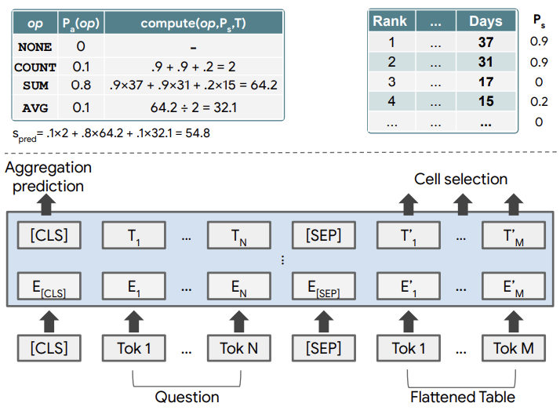
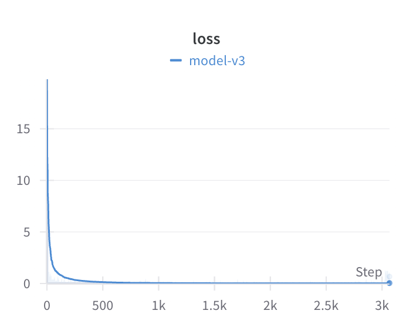

# Budgetwise Machine Learning Engineer Intern Challenge
> Generate fake user bank and credit card transaction data and run relevant queries with a NLP model.

## Overview
This repository contains two major components:
- a script that generates synthetic bank and credit card transaction data for a fictional user dating back to the last 24 months
    - auto-generated user profile
    - transactions include date, amount, merchant, and spending category
- a training and inference script for a NLP model that can process natural language queries related to the user’s transaction history

## Usage
Clone the repository.
```shell
git clone git@github.com:joe-lin-tech/budgetwise.git
cd budgetwise
```

Create and activate a virtual environment. (Alternatively, use an existing environment of your choosing.)
```shell
python3 -m venv venv
source venv/bin/activate
```

Install required pip packages and dependencies.
```shell
python3 -m pip install -r requirements.txt
```

Login to a wandb account if you plan to run the training script and would like to view train logs.
```shell
wandb login
```

Trained model checkpoints can be downloaded from [this drive](https://drive.google.com/drive/folders/1upZtIfHsucYy6cmJo2a8-6yT9dVD5Amt?usp=sharing).

Your local environment should now be suitable to run the scripts in this repository.

<details open>
<summary>Generation Script</summary>

As a summary, this script can generate (1) a list of merchants, (2) a transaction history, (3) a database of users, (4) relevant queries as training data.

1. **Generate Merchants.** The following command generates a list of 100 merchants and saves it to merchants.csv:

    ```shell
    python3 generate.py -t merchants -n 100 -s merchants.csv
    ```

2. **Generate Transactions.** The following command generates a history of 48 transactions from the past year, given a list of merchants:

    ```shell
    python3 generate.py -t transactions -n 48 -f merchants.csv
    ```

3. **Generate Users.** The following command generates a database of 10 users with 48 transactions from the past year, given a list of merchants:

    ```shell
    python3 generate.py -t users -n 10 -f merchants.csv -s users.csv
    ```

4. **Generate Queries.** The following command generates a set of queries based on provided user + transaction data.

    ```shell
    python3 generate.py -t queries
    ```

For more details on command line arguments and function API, expand the following:
<details>
<summary>Generation Script Args and API Details</summary>

| Specifier | Usage |
| --------- | --------- |
| ```-t```, ```--type``` | type of data to generate (```merchants```, ```transactions```, ```users```, or ```queries```) |
| ```-n```, ```--num``` | number of data points to generate |
| ```-d```, ```--delta``` | how far in the past to generate transactions from (in days) |
| ```-f```, ```--file``` | path to data source file |
| ```-s```, ```--save-file``` | path to save file |

```shell
generate_merchants(num: int = 1000, save_file: str = None)
    Generates a list of fake merchants and saves their name and corresponding category in a file.
    
    If the argument `save_file` is None, the list is saved as merchants.csv in the current working directory.
    
    Args:
        num: Number of fake merchants to generate (default is 1000)
        save_file: Path to save file (default is None)
```

```shell
generate_transactions(num: int = 48, delta: int = 365, file: str = 'merchants.csv', save_file: str = None)
    Generates a list of fake transactions (from `delta` days in the past to now) given a list of merchants.
    
    If the argument `save_file` is None, the list of transactions is returned instead.
    
    Args:
        num: Number of fake transactions to generate (default is 48)
        delta: Number of days in the past to generate transactions from (default is 365)
        file: Path to list of merchants (default is merchants.csv)
        save_file: Path to save file (default is None)
    
    Returns:
        List of generated transactions
```

```shell
generate_users(num: int = 10, file: str = 'merchants.csv', save_file: str = None)
    Generates a list of fake users and saves their profile and transactions in a file.
    
    If the argument `save_file` is None, the list is saved as users.csv in the current working directory.
    
    Args:
        num: Number of fake users to generate (default is 10)
        file: Path to list of merchants for generating transactions from (default is merchants.csv)
        save_file: Path to save file (default is None)
```

```shell
generate_queries(file: str = 'users.csv', save_file: str = None)
    Generates a set of queries in a SQA-similar format.
    
    If the argument `save_file` is None, the list is saved as data.csv in the current working directory.
    
    Args:
        file: Path to list of users (default is users.csv)
        save_file: Path to save file (default is None)
```
</details>
</details>

<br>
<details open>
<summary>Training + Inference Script</summary>

To train the model, simply run the following:
```shell
python3 train.py
```

For inference, there are two modes to run under:

1. **Score.** Run model inference with randomly generated queries on a generated user and transaction database.
    ```shell
    python3 predict.py -m score -c model.pt
    ```

2. **Input.** Run model inference with user input queries on a generated user and transaction database.
    ```shell
    python3 predict.py -m input -c model.pt
    ```

Note that if you are using the provided model checkpoint, specify the file path with the ```-c``` argument.
</details>

## Model Architecture
The model is a fine-tuned version of TAPAS [[1]](#1), which is capable of handling common Table Question Answering tasks including cell selection and aggregation queries. Input tokens are processed in a series of attention and linear layers, structured in the same way as BERT. An aggregation operator is predicted with the class token and cell selection is performed on output table embeddings. In addition to the SUM, COUNT, and AVERAGE aggregation operators used in the original paper, this repository's implementation also includes ARGMAX_SUM, ARGMAX_MIN, ARGMAX_STD, and ARGMIN_STD to account for relevant spending pattern queries. The general architecture is depicted below [[1]](#1):


## Training Pipeline
The training data is generated from the aforementioned script and contains queries of the following forms:
- Between ```start_date``` and ```end_date```, how many transactions were made?
- How many transactions were made between ```start_date``` and ```end_date```?
- What category did I spend the most on?
- What was my biggest spending category?
- What category did I spend the least on?
- What was my smallest spending category?
- What spending category am I most inconsistent in from ```ref_timestamp``` to ```now_timestamp```?
- What category am I least consistent in from ```ref_timestamp``` to ```now_timestamp```?
- What spending category am I most consistent in from ```ref_timestamp``` to ```now_timestamp```?
- What is the total amount I've spent from ```ref_timestamp``` to ```now_timestamp```?
- What is the total amount I've spent from ```num_days``` days ago to today?
- In the last ```num_days``` days, how much did I spend in total?
- What is the total amount I've spent in ```category``` from ```ref_date``` to ```now_timestamp```?
- What is the total amount I've spent in ```category``` from ```num_days``` days ago to today?
- What is the total amount I've spent in ```category```?
- What is the total amount I've spent at ```merchant```?
- What merchant did I spend the most on?

The queries are collectively stored in a `pd.DataFrame` structured like below:
|   | date | amount | merchant | category |
|--:|-----:|-------:|:---------|:---------|
| 0 | 1673590885 | 23.23 | Blair-Harper | business |
| 1 | 1673952534 | 172.26 | Moore, Ramirez and Young | contracted |
| 2 | 1674007951 | 246.93 | Rodgers, Russell and Larson | retail |
| 3 | 1674456195 | 169.5 | Hart LLC | professional |
| ... | ... | ... | ... | ... |

Note that transaction dates are stored as Unix timestamps such that the model can interpret a temporal order when processing the input query tokens.

The data is tokenized using a predefined dictionary and are formatted for training TAPAS with strong supervision. Samples are batch processed and inputted into a TAPAS-based model and trained with the hyperparameters below. As mentioned before, the aggregation operator prediction head is expanded to 8 classes (including NONE).

| Hyperparameter | Value |
| --------- | --------- |
| EPOCHS | 2 |
| BATCH_SIZE | 16 |
| LEARNING_RATE | 5e-5 |

| Optimizer | Parameters |
| --------- | --------- |
| Adam | Weight Decay: 0 |

## Inference Pipeline
To conduct inference, the input queries are first processed through a SparkNLP pipeline and its ```MultiDateMatcher``` [[2]](#2) that extracts and replaces dates with Unix timestamps. Queries are then tokenized and inputted into the model for processing just like in the training pipeline. Model outputs are finally postprocessed with aggregation operators applied to selected cells, giving the final output.

## Results
Qualitatively, the fine-tuned model is capable of handling most query types within the training data. From basic experiments, it seems that the model is also performant on compound queries, which are not present in the training data. With more compute resources and training time, a production-level ensemble model can be created to achieve better performance across all queries.

For reference, this is a training log for one of the model iterations:


## References
<a id="1">[1]</a>
J. Herzig, P. Krzysztof Nowak, T. Muller, F. Piccinno, J. Martin Eisenschlos. TAPAS: Weakly Supervised Table Parsing via Pre-training. 2020.

<a id="2">[2]</a>
V. Kocaman, D. Talby. Spark NLP: Natural Language Understanding at Scale. 2021.